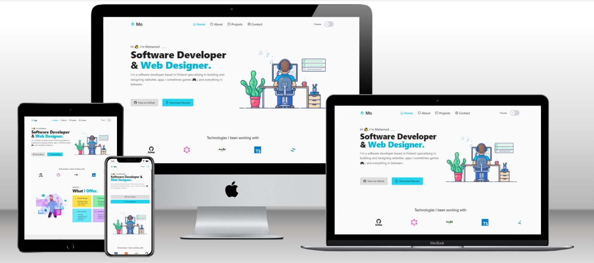

# Responsive React Portfolio


 
```
⭐ This Portfolio is written using TypeScript and the latest version of ReactJS 
```

## :crown: Features

 &nbsp;  &nbsp;  &nbsp;  &nbsp;  &nbsp; 

## :eye_speech_bubble: Live demo

Check live demonstration <a href="https://mohamed-dev-profile.netlify.app/" target='_blank' rel='noreferrer'><strong>here</strong></a>

## Tech

- [React]
- [Typescript]

## :gear: Contribution

If you have any suggestions on what to improve in <em>portfolioV2</em> and would like to share them, feel free to leave an issue or fork project to implement your own ideas :slightly_smiling_face:

[React]: https://react.dev/
[Typescript]: https://www.typescriptlang.org/
